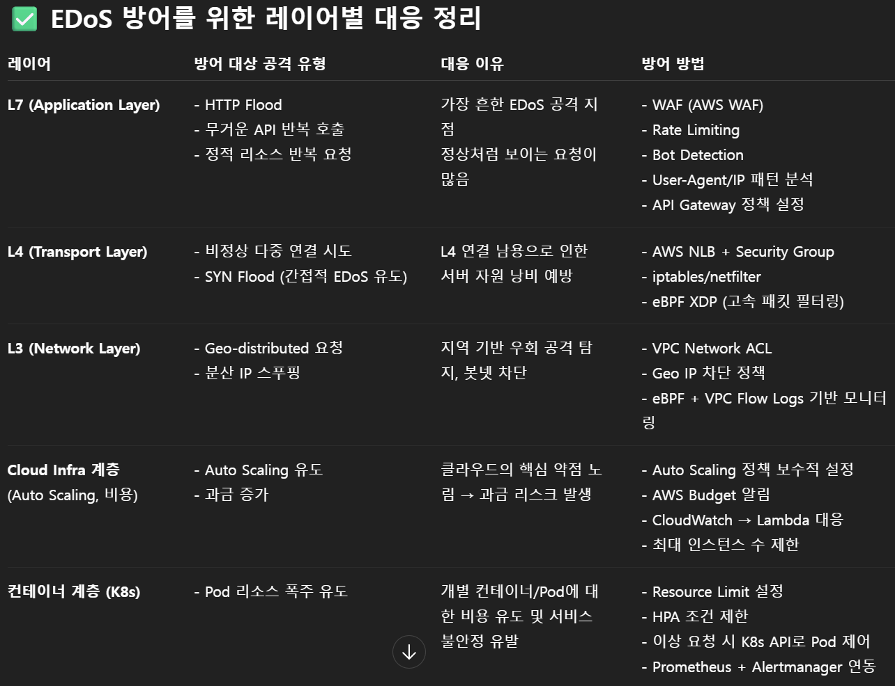
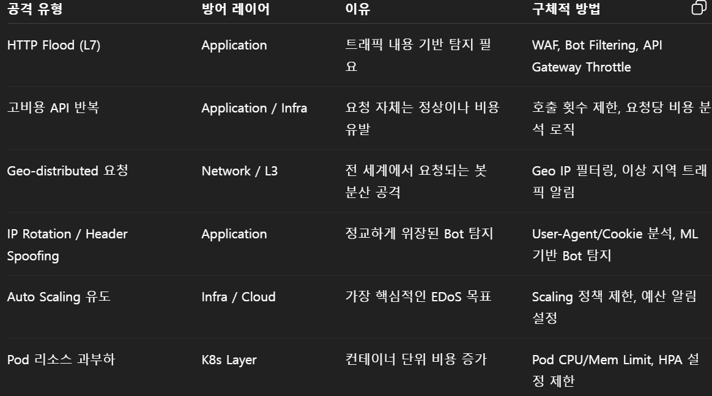

EDoS
EDos는 경제적 서비스 거부 공격으로, 서비스 중단이 아닌 **과도한 비용 발생**을 목표로 함

방식
대규모 트래픽을 지속적으로 발생시켜 Auto Scaling을 유발함
=> 막대한 비용 발생

공격 방식
1. Bot
    정상적인 트래픽처럼 위장하여 요청을 다량 전송
2. HTTP Flood
    L7에서 대량의 요청으로 서버 CPU/메모리 소모 유도
    연산량이 많은 API 호출 집중 공략
3. 리소스 소모 유도형 요청
    비용이 많으 드는 요청 반복
    (PDF/이미지 변환 API 호출 같은 요청)
4. Geo-distributed 
    전 세계 수많은 IP에서 접근하는 것처럼 위장하여 Bot detection 회피
5. IP Rotation + header spoofing
    User-Agent, Referer, Cookie 등을 랜덤하게 조작해서 탐지 회피

주로 1번 + (2,3,4,5)번의 방법들을 조합하여 공격하는 방식

주로 L7(application layer)와 Infra, k8s 레이어에서 주로 발생하는 것을 확인할 수 있음
=> Application + Cloud Infra + k8s 중심의 방어 전략이 중요하지 않을까?

공격을 탐지, 대응, 모니터링하는 기능이 필요함
탐지 및 대응 컨테이너, 모니터링 컨테이너 2개로 구성하는 건 어떨까?

그중에서도 탐지 및 대응 컨테이너가 핵심파트라고 생각함
모니터링 컨테이너는 k8s의 pod 모니터링 기능 또는 CloudWatch로 될 것 같은 느낌

탐지 및 대응 컨테이너
1. 요청 수집
    사용자 or 봇이 보내는 http 요청 탐지 
2. 트래픽 분석
    Rule 기반으로 트래픽 분석
    ML을 사용하여 패턴 분석도 여기 파트일 것
3. 이상 여부 판단
    트래픽 분석 결과에 따른 임계치를 초과하는지 확인
4. 대응
    WAF에 IP 등록
    Auto Scaling 차단 or 상한선 정하기
5. 로그 및 알람 처리

탐지 및 대응 중에서도 탐지가 가장 중요한 부분이라고 생각됨
트래픽 분석도 일단 Rule 기반으로 하고, 이후에 ML을 적용하여 패턴을 파악해보는 게 어떨까?

