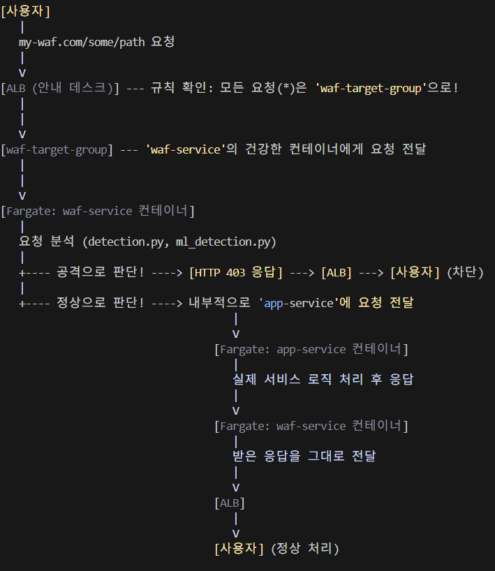

#날짜 및 내용 작성할 것!!!!

## 7월 2일
#### 금일 내용
기획안 작성.</br>
#### 다음날 할일
기획안 마저 작성.(E-dos 정의 내리기 및 어떻게 막을지 생각해오기)

## 7월 3일
#### 금일 내용
EDoS에 대한 조사</br>
#### 다음날 할일
Jenkins에 대한 공부를 진행하며, Jenkins와 Github 연동 테스트 진행 중.
테스트를 purekm의 repo로 진행 중
로컬 Docker에서 Jenkins를 설치했으며, Github Webhook과 연동을 하기 위해 ngrok을 사용함


ngrok에 200 OK 가 처리되었으며, Jenkins에서 System Log 또한 잘 받았다고 로그가 나옴
하지만.. 빌드는 아직 되지 않음
Jenkins에서 Docker를 통한 이미지 자동 빌드를 실행 중 컨테이너를 지워서 처음부터 다시 시작..
시행착오
1. Jenkins 컨테이너에는 Docker cli가 깔려있어야 함
2. docker socket을 실행할 수 있는 권한을 jenkins에도 줘야함

## 7월 9일
#### 현재 진행 상황

---

### ✅ **현재까지 진행한 구조 요약**

#### 1. **탐지 시스템 구조**

* **FastAPI 서버 기반의 탐지 API 구현**

  * `/detect` 엔드포인트에서 요청 수신
  * 1단계: **룰 기반 탐지** (`rule_detect(data)`)
  * 2단계: **ML 기반 탐지** (`ml_detect(data)`)
  * 탐지되면 `{"anomaly": True, "method": "rule"}` 또는 `{"anomaly": True, "method": "ml"}`로 응답

* **룰 기반 탐지 로직**

  * IP당 요청 횟수(예: 60초에 100회 이상 요청)
  * User-Agent가 비정상 목록(`curl`, `python-requests` 등)에 포함
  * `Accept` 헤더 조작 여부 등도 체크 고려

* **ML 기반 탐지 로직**

  * IsolationForest 등의 이상치 탐지 알고리즘 적용 (구현 중이거나 예정)

---

#### 2. **컨테이너화 및 배포 계획**

* Python 앱을 Docker로 컨테이너화 완료 또는 진행 중

* `Jenkins`를 통한 **CI/CD 파이프라인** 구현 시작

  * GitHub Webhook으로 Push 시 자동 빌드 연동 성공
  * Jenkins에서 Git 플러그인 오류 해결도 진행됨

* 향후 계획:

  * Docker 이미지 → \*\*ECR(AWS)\*\*에 업로드
  * Kubernetes 클러스터에서 서비스로 배포 (예정)

---

#### 3. **AWS 기반 대응 시스템 설계 (예정 포함)**

* **탐지 결과에 따라 EventBridge, Lambda, WAF 등과 연동**

  * 이상 탐지 시 WAF IP 차단 룰 적용
  * 로그 수집 및 모니터링: CloudWatch or ELK Stack

---

### 📌 정리하자면

| 구성요소          | 구현 상태 | 설명                     |
| ------------- | ----- | ---------------------- |
| FastAPI 탐지 서버 | ✅     | 룰 + ML 탐지 분기 구조 완성     |
| 룰 기반 탐지       | ✅     | IP 횟수, UA 블랙리스트 등      |
| ML 탐지         | ⏳     | 기본 뼈대 존재, 모델 학습/튜닝 필요  |
| Dockerfile    | ⏳     | 컨테이너화 작업 진행 중          |
| Jenkins CI/CD | ✅     | GitHub Webhook까지 연동 완료 |
| AWS 서비스 연동    | ⏳     | Lambda, WAF 등은 설계만 있음  |
| 쿠버네티스 배포      | ⏳     | 설계 계획 존재, 실제 배포 전 단계   |


---

#### 탐지 및 대응 아키텍처 설계

---

## 🧠 프로젝트 목표

> **EDoS (Economic Denial of Sustainability)** 공격을 탐지하고 대응하는 **보안 마이크로서비스 시스템**
> – 빠른 탐지, 자동 대응, AWS 연동, 하이브리드 탐지 구조 지향

---

## ✅ 아키텍처 요약 (전체 흐름)

```plaintext
[클라이언트 요청] 
       ↓
[FastAPI 서버 (/detect)]
       ↓
[1차 탐지: rule_detect()]
   └── 이상 ⇒ 즉시 대응
       ↓
[2차 탐지: ml_detect()]
   └── 이상 ⇒ 대응
       ↓
[정상 처리 or 로그 저장]
```

---

## 📦 구성 요소별 아키텍처

### 1. **FastAPI API 서버 (`app.py`)**

| 역할     | 설명                                            |
| ------ | --------------------------------------------- |
| 요청 수신  | `/detect` API에서 JSON 요청을 받음                   |
| 탐지 호출  | `rule_detect(data)` + `ml_detect(data)` 순차 호출 |
| 대응 트리거 | 탐지 결과가 True면 대응 로그 출력 or 대응 함수 호출 예정          |

---

### 2. **Rule 기반 탐지기 (`detection.py`)**

| 탐지 기준            | 설명                                           |
| ---------------- | -------------------------------------------- |
| IP 폭주            | 같은 IP가 60초 동안 100회 이상 요청                     |
| User-Agent 블랙리스트 | curl, python-requests, wget, 공백 UA           |
| URI 반복           | `/checkout` 등 민감 URI에 30회 이상 접근 또는 정적 URI 반복 |

> ➕ 캐시 메모리를 활용해 IP별 요청 기록을 관리 (`deque`)

---

### 3. **ML 기반 탐지기 (`ml_detection.py`)**

| 탐지 방식 | 설명                                                 |
| ----- | -------------------------------------------------- |
| 모델 파일 | `model.pkl` (IsolationForest 등 사전 학습된 모델)          |
| 입력 벡터 | `[req_count, interval, uri_len, ua_len]` 등으로 특징 추출 |
| 탐지 결과 | `-1 → 이상`, `1 → 정상` 으로 판단                          |

> ➕ 추후 로그 데이터를 기반으로 재학습 가능

---

### 4. **대응 로직 (현재: 내부 print, 이후: 대응 모듈)**

\| 현재 | 콘솔에 로그 출력 |
\| 이후 확장 | `responder.py`로 모듈 분리하여 다음 대응 수행 예정:

* WAF 차단 (AWS WAF IPSet)
* 로그 저장 (CloudWatch, JSON, DB)
* 관리자 알림 (SNS, Slack, 이메일 등)

---

### 5. **테스트용 시뮬레이터 (`test_detect.py`)**

| 역할    | 설명                          |
| ----- | --------------------------- |
| 요청 전송 | FastAPI 서버에 다양한 트래픽을 보내 테스트 |
| 시나리오  | 정상 요청, 블랙 UA, 요청 폭주 등 구성    |
| 확인 방법 | 응답 JSON과 FastAPI 콘솔 로그로 확인  |

---

## 🔁 전체 통신 흐름

```plaintext
+--------------------+
| Test Script / Client
+--------------------+
          |
          V
+--------------------+
| FastAPI Server (/detect)
+--------------------+
     |         |
     V         V
[rule_detect]  [ml_detect]
     ↓             ↓
  if True        if True
     ↓             ↓
+--------------------+
| 대응 (print → 대응 모듈로 확장 예정)
+--------------------+
```

---

## 📡 향후 확장 예정

| 항목                       | 설명                               |
| ------------------------ | -------------------------------- |
| ✅ 대응 모듈 (`responder.py`) | AWS WAF IPSet 차단, 로그 기록 등        |
| ✅ 로그 저장                  | JSON file, SQLite, DynamoDB 등    |
| ✅ 컨테이너화                  | 각 모듈을 Docker + Kubernetes로 분리 가능 |
| ✅ 자동 학습 파이프라인            | 로그 수집 → 주기적 재학습 → 모델 교체 자동화      |
| ✅ 대시보드 시각화               | Grafana, React, Kibana 등과 연동 가능  |

---

## ✅ 요약

| 범주     | 설명                      |
| ------ | ----------------------- |
| 탐지 방식  | 룰 + 머신러닝 하이브리드          |
| 서버 구조  | FastAPI + 분리된 탐지 모듈     |
| 대응 방식  | 초기엔 로그, 이후 AWS 자원 제어 예정 |
| 테스트 구조 | 수동 curl + 자동 테스트 스크립트   |

---

## 7월 13일
#### 탐지 방식

---

## ✅ 하이브리드 탐지 전략: 역할 분담 기준

| 구분        | Rule 기반 탐지 (RBT)          | ML 기반 탐지 (MLBT)                      |
| --------- | ------------------------- | ------------------------------------ |
| **역할**    | 명확한 패턴, 반복적 행동 탐지         | 패턴이 없거나 위장된 이상 탐지                    |
| **속도**    | 빠름 (실시간 필터링)              | 느림 (데이터 축적 필요)                       |
| **오탐/누락** | 적음 (조건이 명확)               | 높을 수 있음 (초기 튜닝 필요)                   |
| **유형 예시** | 단일 IP의 과도한 요청, 블랙리스트 IP 등 | User-Agent 조합, request 간격 분포 등 이상 징후 |

---

## ✅ Rule 기반 탐지 대상


| 탐지 항목                   | 설명                                            | 예시                                                |
| ----------------------- | --------------------------------------------- | ------------------------------------------------- |
| 📌 IP별 Rate Limit       | 초당/분당 요청 수 제한                                 | 1분 100회 이상 요청 IP 차단                               |
| 📌 URI 접근 제한            | `/api/export`, `/start-job` 등 민감 URI 반복 호출 감지 | 같은 URI 10초 간격 50회 호출                              |
| 📌 User-Agent blacklist | Bot UA 또는 비정상 조합 차단                           | `User-Agent: python-requests`, `curl/...`         |
| 📌 Referrer/Cookie 없음   | 봇이 생성한 비세션 요청 탐지                              | `Referer`, `Cookie` 헤더 없는 경우 차단                   |
| 📌 GeoIP 필터링            | 비정상 국가나 ASN 필터                                | 러시아, 인도 IP가 80% 이상인 요청 차단                         |
| 📌 Header 조합 체크         | Header 간 상관관계 없는 비정상 조합 탐지                    | `Mozilla UA` + `no Accept` + `no Accept-Language` |
JA3 기반 추가
---

## ✅ ML 기반 탐지 대상


| 탐지 항목                   | 설명                                         | 예시                                      |
| ----------------------- | ------------------------------------------ | --------------------------------------- |
| 📌 요청 간 시간 간격 패턴        | request 간격이 너무 일정하거나 비정상적이면 탐지             | 1초마다 정확히 요청하는 사용자                       |
| 📌 URI path 다양성/entropy | URI 다양성이 너무 낮거나 너무 높음                      | `/product/1`, `/product/2`... → 자동화 가능성 |
| 📌 User-Agent + IP 상관관계 | 여러 IP가 동일 UA로 요청 → 봇 위장 탐지                 | 50개 IP에서 동일 UA                          |
| 📌 Feature 조합 기반 이상 탐지  | IP, UA, Time, Geo, Path 등을 벡터로 조합 → 이상치 탐지 | IsolationForest, LOF 등                  |
| 📌 세션 행동 이상치            | 세션 흐름의 비정상 순서나 반복                          | `/login` → `/logout` 반복                 |
| 📌 Geo 분포 벡터            | 동일 요청이 너무 다양한 국가에서 발생                      | 다수의 국가에서 `/api/home` 요청 집중              |

---

#### 다음날 할일
EDoS 공격에 대한 이해
CIC-DDoS2019 같은 공개 데이터셋 확인
시뮬레이션 트래픽 커스터마이징

##### EDoS에 대한 이해

DDoS와 EDoS의 차이점
DDoS
시스템 다운이 목적
고강도, 단시간
대량의 트래픽

EDoS
비용 유발이 목적
저강도, 장시간
정상처럼 보이는 요청 반복

정상처럼 보이는 요청을 장기간 꾸준히 보냄으로써 비용 유발이 목적인 공격..!
정상처럼 보이니까 탐지가 중요함

EDoS 데이터셋은 없으니까 유사한 DDoS 데이터셋을 사용하면 어떨까? 라는 생각을했는데,
문득 생각해보니, EDoS는 정상처럼 보이는 요청이라고 했다.
=> 정상적인 요청을 일정한 패턴으로 반복하거나, 수정하면 EDoS 트래픽이 되지 않을까?

## 7월 16일
#### ML

| Feature                        | 의미                           | EDoS 공격에서 탐지 방식                                                                                                             |
| ------------------------------ | ---------------------------- | --------------------------------------------------------------------------------------------------------------------------- |
| **`req_count`**                | 특정 IP의 누적 요청 수               | - EDoS는 IP 한 개가 수천 번 요청해서 **요금 증가** 유도<br>- `req_count`가 비정상적으로 크면 **비용 유발 목적의 공격**으로 의심                                    |
| **`interval`**                 | 요청 간 시간 간격 (log 스케일)         | - EDoS는 **짧은 간격**으로 다량 요청 (ex. 초당 수십 회)<br>- `interval`이 **지속적으로 매우 작으면** 공격 가능성↑                                           |
| **`path_depth`**               | URI의 슬래시 깊이                  | - 일반 사용자는 보통 `/home`, `/product/1` 수준<br>- `/admin/log/errors/trace/stack`처럼 **깊은 경로 접근**은 봇 스캔이나 자동화 탐색으로 의심됨              |
| **`path_token_count`**         | URI 경로 조각 수                  | - `path_depth`와 유사한 개념<br>- 너무 많은 토큰은 **탐색 또는 자동 생성 URI**일 가능성                                                              |
| **`path_token_numeric_ratio`** | URI 중 숫자 비율                  | - `/user/12345`, `/product/98765`처럼 **숫자 반복 조회**는 EDoS 공격에서 자주 나타남<br>- 봇이 수십/수백 개의 ID를 루프 돌며 조회하는 경우                       |
| **`uri_entropy`**              | URI 문자 복잡도 (Shannon Entropy) | - `/login`보다 `/a4Jk_8D9!` 같은 경로는 **비정상 자동화 URI**일 가능성↑<br>- 엔트로피가 너무 높거나 낮으면 **이상 징후**                                      |
| **`cookie_count`**             | 쿠키 개수                        | - 일반 사용자는 `sessionid`, `cart` 등 소수 쿠키<br>- 쿠키가 아예 없거나, **비정상적으로 많으면** → 세션 없는 봇 또는 조작된 요청 의심                                |
| **`referer_domain`**           | 유입 출처 도메인                    | - 정상 사용자는 `google.com`, `naver.com`, `tistory.com` 등 유입<br>- `localhost`, 없음(`""`), 이상한 도메인 → **직접 URL 입력 or 자동화 툴 사용 가능성** |
| **`method`**                   | HTTP 요청 방식                   | - GET/POST가 일반적<br>- EDoS에서 **반복 POST** 또는 드문 PUT/DELETE 요청은 공격 가능성↑                                                        |
| **`accept_type`**              | 클라이언트가 원하는 응답 형식             | - 일반 사용자는 `text/html`, `application/json` 선호<br>- `*/*` 또는 보기 드문 값은 **자동화 봇**일 가능성↑                                         |

## 8월 16일
#### 대응 및 이후의 부분은 어떻게 하는게 좋을까? 

대응

1. 요청 발생: 사용자의 모든 요청은 실제 서비스가 아닌 API Gateway로 먼저 들어옵니다.
2. WAF 연동 (탐지): API Gateway는 받은 요청을 그대로 WAF(현재 제작하신 탐지 서비스)의 `/detect` 
      엔드포인트로 전달하여 공격 여부를 검사합니다.
3. 정상 트래픽 처리: WAF가 "정상"이라고 판단하면({"anomaly": false}), API Gateway는 해당 요청을 원래
      목적지였던 실제 서비스(API 서버)로 전달하고 그 결과를 사용자에게 반환합니다.
4. 공격 트래픽 처리 (대응): WAF가 "공격"이라고 판단하면({"anomaly": true}), API Gateway는 요청을 실제
      서비스로 보내지 않고 즉시 연결을 끊거나 에러 페이지(HTTP 403 Forbidden)를 반환합니다.

API Gateway + EKS를 사용하려고 했더니.. 예상하지 못한 사용할 게 많음.. 고정 비용이 만만치 않을 것 같은?
EKS에서 기본 controlplane만 유지해도 월 72달러 라고 하네..
그래서 추가된 ALB + Fargate 버전

ALB + Fargate 버전 
[시나리오]
   * WAF 서비스: waf-service (Fargate에서 실행)
   * 실제 애플리케이션: app-service (Fargate에서 실행)
   * ALB 주소: my-waf.com

   

   1. 요청 시작: 사용자가 my-waf.com/some/path(예시)로 접속합니다. 이 요청은 먼저 ALB에 도달합니다.

   2. ALB의 라우팅: ALB는 설정된 규칙을 확인합니다. 우리는 "모든(`*`) 경로로 들어오는 요청은 
      `waf-target-group`으로 보내라" 는 규칙을 설정해 둡니다. waf-target-group은 waf-service 컨테이너들의
      목록을 가지고 있습니다.

   3. 요청 전달: ALB는 waf-target-group에 등록된 건강한 waf-service 컨테이너 중 하나를 골라 요청을 전달합니다.

   4. WAF 탐지 로직 실행: waf-service 컨테이너는 받은 요청을 가지고, 작성하신 detection.py와 ml_detection.py 로직을 실행하여 공격 여부를 판단합니다.

   5. 판단 및 분기:
       * 5a. 공격일 경우 (대응): WAF 서비스는 즉시 HTTP 403 Forbidden 응답을 생성하여 ALB에게 돌려줍니다.
         ALB는 이 응답을 그대로 사용자에게 전달하고, 요청 처리는 여기서 끝납니다. 실제 서비스는 아무런 
         영향을 받지 않습니다.
       * 5b. 정상일 경우 (프록시): WAF 서비스는 이제 리버스 프록시(Reverse Proxy) 역할을 해야 합니다.

   6. 내부 프록시: waf-service는 받은 요청(헤더, 본문 등)을 거의 그대로 복사하여, VPC 내부 네트워크를 통해
      app-service의 내부 주소(예: http://app-service.internal:8080)로 새로운 요청을 보냅니다.

   7. 실제 서비스 처리: app-service 컨테이너는 waf-service로부터 받은 요청을 처리하고, 그 결과를 다시
      waf-service에게 응답합니다.

   8. 최종 응답: waf-service는 app-service로부터 받은 응답을 그대로 ALB에게 전달하고, ALB는 이 최종 응답을
      사용자에게 보여줍니다.

  구현을 위한 단계 (Action Plan)

  이 아키텍처를 구현하기 위해 필요한 작업은 다음과 같습니다.

   1. 애플리케이션 코드 수정:
       * app.py 또는 별도의 responder.py에 리버스 프록시 기능을 추가해야 합니다.
       * 정상 트래픽일 때, 환경변수(BACKEND_URL) 등으로 주입된 실제 서비스의 주소로 요청을 전달하는 코드를
         작성합니다. (Python httpx 라이브러리 추천)

   2. Dockerfile 작성:
       * 수정된 Python 애플리케이션을 실행하는 Dockerfile을 완성합니다.

   3. AWS 설정 (웹 콘솔 또는 IaC 사용):
       * ECS Task Definition 생성: WAF와 App 서비스에 대한 "업무 매뉴얼"을 각각 작성합니다. (사용할 Docker
         이미지, CPU/메모리 할당량 등)
       * ALB 및 Target Group 생성:
           * 인터넷과 연결되는 ALB를 하나 생성합니다.
           * waf-target-group과 app-target-group을 만듭니다. (하지만 초기에는 app-target-group을 ALB에 직접
             연결하지 않습니다.)
       * ECS Service 생성:
           * 작성한 Task Definition과 Target Group을 사용하여 waf-service와 app-service를 생성합니다. 이
             과정에서 Fargate가 컨테이너들을 실행시킵니다.
       * ALB 리스너 규칙 설정: ALB의 기본 규칙이 waf-target-group을 향하도록 설정합니다.


