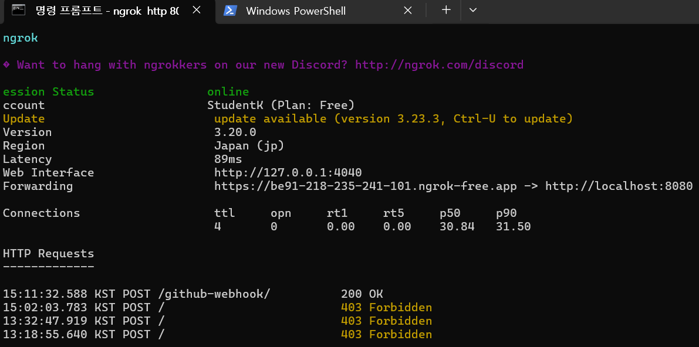
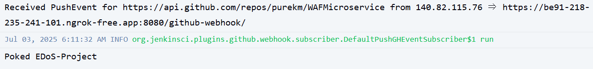

#날짜 및 내용 작성할 것!!!!

## 7월 2일
#### 금일 내용
기획안 작성.</br>
#### 다음날 할일
기획안 마저 작성.(E-dos 정의 내리기 및 어떻게 막을지 생각해오기)

## 7월 3일
#### 금일 내용
EDoS에 대한 조사</br>
#### 다음날 할일
Jenkins에 대한 공부를 진행하며, Jenkins와 Github 연동 테스트 진행 중.
테스트를 purekm의 repo로 진행 중
로컬 Docker에서 Jenkins를 설치했으며, Github Webhook과 연동을 하기 위해 ngrok을 사용함



ngrok에 200 OK 가 처리되었으며, Jenkins에서 System Log 또한 잘 받았다고 로그가 나옴
하지만.. 빌드는 아직 되지 않음
Jenkins에서 Docker를 통한 이미지 자동 빌드를 실행 중 컨테이너를 지워서 처음부터 다시 시작..
시행착오
1. Jenkins 컨테이너에는 Docker cli가 깔려있어야 함
2. docker socket을 실행할 수 있는 권한을 jenkins에도 줘야함

## 7월 9일
#### 현재 진행 상황

---

### ✅ **현재까지 진행한 구조 요약**

#### 1. **탐지 시스템 구조**

* **FastAPI 서버 기반의 탐지 API 구현**

  * `/detect` 엔드포인트에서 요청 수신
  * 1단계: **룰 기반 탐지** (`rule_detect(data)`)
  * 2단계: **ML 기반 탐지** (`ml_detect(data)`)
  * 탐지되면 `{"anomaly": True, "method": "rule"}` 또는 `{"anomaly": True, "method": "ml"}`로 응답

* **룰 기반 탐지 로직**

  * IP당 요청 횟수(예: 60초에 100회 이상 요청)
  * User-Agent가 비정상 목록(`curl`, `python-requests` 등)에 포함
  * `Accept` 헤더 조작 여부 등도 체크 고려

* **ML 기반 탐지 로직**

  * IsolationForest 등의 이상치 탐지 알고리즘 적용 (구현 중이거나 예정)

---

#### 2. **컨테이너화 및 배포 계획**

* Python 앱을 Docker로 컨테이너화 완료 또는 진행 중

* `Jenkins`를 통한 **CI/CD 파이프라인** 구현 시작

  * GitHub Webhook으로 Push 시 자동 빌드 연동 성공
  * Jenkins에서 Git 플러그인 오류 해결도 진행됨

* 향후 계획:

  * Docker 이미지 → \*\*ECR(AWS)\*\*에 업로드
  * Kubernetes 클러스터에서 서비스로 배포 (예정)

---

#### 3. **AWS 기반 대응 시스템 설계 (예정 포함)**

* **탐지 결과에 따라 EventBridge, Lambda, WAF 등과 연동**

  * 이상 탐지 시 WAF IP 차단 룰 적용
  * 로그 수집 및 모니터링: CloudWatch or ELK Stack

---

### 📌 정리하자면

| 구성요소          | 구현 상태 | 설명                     |
| ------------- | ----- | ---------------------- |
| FastAPI 탐지 서버 | ✅     | 룰 + ML 탐지 분기 구조 완성     |
| 룰 기반 탐지       | ✅     | IP 횟수, UA 블랙리스트 등      |
| ML 탐지         | ⏳     | 기본 뼈대 존재, 모델 학습/튜닝 필요  |
| Dockerfile    | ⏳     | 컨테이너화 작업 진행 중          |
| Jenkins CI/CD | ✅     | GitHub Webhook까지 연동 완료 |
| AWS 서비스 연동    | ⏳     | Lambda, WAF 등은 설계만 있음  |
| 쿠버네티스 배포      | ⏳     | 설계 계획 존재, 실제 배포 전 단계   |


---

#### 탐지 및 대응 아키텍처 설계

---

## 🧠 프로젝트 목표

> **EDoS (Economic Denial of Sustainability)** 공격을 탐지하고 대응하는 **보안 마이크로서비스 시스템**
> – 빠른 탐지, 자동 대응, AWS 연동, 하이브리드 탐지 구조 지향

---

## ✅ 아키텍처 요약 (전체 흐름)

```plaintext
[클라이언트 요청] 
       ↓
[FastAPI 서버 (/detect)]
       ↓
[1차 탐지: rule_detect()]
   └── 이상 ⇒ 즉시 대응
       ↓
[2차 탐지: ml_detect()]
   └── 이상 ⇒ 대응
       ↓
[정상 처리 or 로그 저장]
```

---

## 📦 구성 요소별 아키텍처

### 1. **FastAPI API 서버 (`app.py`)**

| 역할     | 설명                                            |
| ------ | --------------------------------------------- |
| 요청 수신  | `/detect` API에서 JSON 요청을 받음                   |
| 탐지 호출  | `rule_detect(data)` + `ml_detect(data)` 순차 호출 |
| 대응 트리거 | 탐지 결과가 True면 대응 로그 출력 or 대응 함수 호출 예정          |

---

### 2. **Rule 기반 탐지기 (`detection.py`)**

| 탐지 기준            | 설명                                           |
| ---------------- | -------------------------------------------- |
| IP 폭주            | 같은 IP가 60초 동안 100회 이상 요청                     |
| User-Agent 블랙리스트 | curl, python-requests, wget, 공백 UA           |
| URI 반복           | `/checkout` 등 민감 URI에 30회 이상 접근 또는 정적 URI 반복 |

> ➕ 캐시 메모리를 활용해 IP별 요청 기록을 관리 (`deque`)

---

### 3. **ML 기반 탐지기 (`ml_detection.py`)**

| 탐지 방식 | 설명                                                 |
| ----- | -------------------------------------------------- |
| 모델 파일 | `model.pkl` (IsolationForest 등 사전 학습된 모델)          |
| 입력 벡터 | `[req_count, interval, uri_len, ua_len]` 등으로 특징 추출 |
| 탐지 결과 | `-1 → 이상`, `1 → 정상` 으로 판단                          |

> ➕ 추후 로그 데이터를 기반으로 재학습 가능

---

### 4. **대응 로직 (현재: 내부 print, 이후: 대응 모듈)**

\| 현재 | 콘솔에 로그 출력 |
\| 이후 확장 | `responder.py`로 모듈 분리하여 다음 대응 수행 예정:

* WAF 차단 (AWS WAF IPSet)
* 로그 저장 (CloudWatch, JSON, DB)
* 관리자 알림 (SNS, Slack, 이메일 등)

---

### 5. **테스트용 시뮬레이터 (`test_detect.py`)**

| 역할    | 설명                          |
| ----- | --------------------------- |
| 요청 전송 | FastAPI 서버에 다양한 트래픽을 보내 테스트 |
| 시나리오  | 정상 요청, 블랙 UA, 요청 폭주 등 구성    |
| 확인 방법 | 응답 JSON과 FastAPI 콘솔 로그로 확인  |

---

## 🔁 전체 통신 흐름

```plaintext
+--------------------+
| Test Script / Client
+--------------------+
          |
          V
+--------------------+
| FastAPI Server (/detect)
+--------------------+
     |         |
     V         V
[rule_detect]  [ml_detect]
     ↓             ↓
  if True        if True
     ↓             ↓
+--------------------+
| 대응 (print → 대응 모듈로 확장 예정)
+--------------------+
```

---

## 📡 향후 확장 예정

| 항목                       | 설명                               |
| ------------------------ | -------------------------------- |
| ✅ 대응 모듈 (`responder.py`) | AWS WAF IPSet 차단, 로그 기록 등        |
| ✅ 로그 저장                  | JSON file, SQLite, DynamoDB 등    |
| ✅ 컨테이너화                  | 각 모듈을 Docker + Kubernetes로 분리 가능 |
| ✅ 자동 학습 파이프라인            | 로그 수집 → 주기적 재학습 → 모델 교체 자동화      |
| ✅ 대시보드 시각화               | Grafana, React, Kibana 등과 연동 가능  |

---

## ✅ 요약

| 범주     | 설명                      |
| ------ | ----------------------- |
| 탐지 방식  | 룰 + 머신러닝 하이브리드          |
| 서버 구조  | FastAPI + 분리된 탐지 모듈     |
| 대응 방식  | 초기엔 로그, 이후 AWS 자원 제어 예정 |
| 테스트 구조 | 수동 curl + 자동 테스트 스크립트   |

---


